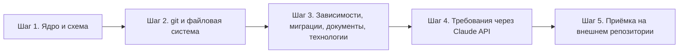

# План реализации агента сбора проектных знаний

Порядок реализации первой версии агента, описанного в [техническом задании](./project-knowledge-agent.md):
пять шагов от каркаса до приёмки, каждый завершается наблюдаемым фактом.

---

## Навигация

- [Принцип разбиения](#принцип-разбиения)
- [Шаг 1. Ядро, схема и командный интерфейс](#шаг-1-ядро-схема-и-командный-интерфейс)
- [Шаг 2. История изменений и рабочая копия](#шаг-2-история-изменений-и-рабочая-копия)
- [Шаг 3. Содержание файлов и технологии](#шаг-3-содержание-файлов-и-технологии)
- [Шаг 4. Извлечение требований](#шаг-4-извлечение-требований)
- [Шаг 5. Приёмка на внешнем репозитории](#шаг-5-приёмка-на-внешнем-репозитории)
- [Ограничения плана](#ограничения-плана)
- [Версионирование](#версионирование)

---

## Принцип разбиения

Шаги идут от ядра к фактам и от детерминированных источников к выводимым: сначала строится контракт
выгрузки, затем его наполняют анализаторы, и только потом добавляется единственный недетерминированный
источник — модель.



Каждый шаг оставляет систему работоспособной: после любого из них `agent export` отрабатывает целиком
и даёт файл, проходящий `agent validate`. Разница между шагами — в том, какие массивы выгрузки непусты.

---

## Шаг 1. Ядро, схема и командный интерфейс

**Что делается.** Создаётся пакет Python с консольной точкой входа, модель сущностей и связей,
формирование идентификаторов, сборка Evidence, сериализация с сортировкой по `id`, JSON Schema
и валидатор. Анализаторов ещё нет — регистрируется только их контракт.

```text
agent/
├── core/
│   ├── model.py        сущности, связи, Evidence, накопитель фактов
│   ├── ids.py          правила формирования идентификаторов
│   ├── registry.py     контракт и реестр анализаторов
│   ├── exporter.py     сборка выгрузки, сортировка, запись
│   ├── validator.py    проверки по схеме и правилам целостности
│   └── jsonschema.py   проверка по JSON Schema без внешних зависимостей
├── schema/
│   └── project-knowledge.schema.json
├── config.py           чтение agent.yml, отказ на неизвестном ключе
└── cli.py              команды export и validate, коды возврата

tests/
└── step1_acceptance.py приёмка шага одной командой
```

**Результат.** `agent export <путь>` на произвольном каталоге завершается кодом `0` и создаёт файл
со всеми корневыми ключами, где массивы пусты, а `project` заполнен. `agent validate` на этом файле
возвращает `0`, на файле с удалённым `evidence_ids` — `2`. Скрипт `tests/step1_acceptance.py`
прогоняет проверки шага одной командой и возвращает `0`, когда сбоев нет.

**Закрывает пункты приёмки:** вся группа «Структуры хранилища и схема», а также пункты про коды
возврата `0` и `2` и про отсутствие частичного файла при отказе валидации.

---

## Шаг 2. История изменений и рабочая копия

**Что делается.** Реализуются два анализатора: `filesystem` — обход с учётом `.gitignore` и `exclude`,
каталоги, файлы, расширения, размеры, `sha256`, роли файлов по словарю `data/file-roles.json`;
`vcs.git` — репозиторий, ветки, теги, коммиты, участники, изменённые файлы. Перечень путей при наличии
репозитория берётся у `git ls-files`, который применяет `.gitignore` теми же правилами, что и сам git;
история читается тремя проходами `git log` — метаданные, типы изменений, счётчики строк. Здесь же
реализуется нормализация участников по адресу электронной почты и связи `CONTAINS`, `MODIFIES`,
`AUTHORED_BY`, `COMMITTED_BY`, `PARENT_OF`, `POINTS_TO`, `HAS_BRANCH`, `HAS_TAG`, `HAS_REPOSITORY`.

**Результат.** На репозитории с историей непусты массивы `commits`, `people`, `files`, `directories`,
`relationships`, `evidence`, а числа коммитов, веток, тегов и файлов совпадают с ответами самого git.
Повторный прогон даёт файл, отличающийся только отметками времени. На каталоге без `.git` массив
`repositories` пуст, файлы и каталоги собраны с `repository_id: null`. Скрипт `tests/step2_acceptance.py`
строит временный репозиторий с известной историей и прогоняет проверки шага одной командой.

**Закрывает пункты приёмки:** непустые массивы базовых сущностей, воспроизводимость повторного прогона,
поведение на каталоге без `.git`, ссылочная целостность на реальных данных.

---

## Шаг 3. Содержание файлов и технологии

**Что делается.** Реализуются три анализатора и словарь технологий: `dependencies` — шесть форматов
манифестов и связи `DECLARES`; `migrations` — SQL и Alembic, сущности Migration и Database Object,
связи `AFFECTS` и `BELONGS_TO`; `documentation` — Markdown и reStructuredText, сущность Document
и связь `DEFINES`. Поверх них работает вывод технологий по правилам словаря со связями `USES`
и `INDICATES` и разграничением `declared` и `inferred`.

**Результат.** На проекте с манифестами непусты `dependencies`, `technologies`, `documents`,
а на проекте с миграциями — `migrations` и `database_objects`. Для технологии с `confidence: "declared"`
в `evidence` есть запись с `source_kind: "manifest"` и заполненным `source_locator`.

**Закрывает пункты приёмки:** словарь технологий с правилами не менее чем для пяти технологий,
обнаружение объявленной технологии с подтверждением из манифеста, запросы по технологиям и источникам
фактов.

---

## Шаг 4. Извлечение требований

**Что делается.** Подключается Claude API: схема структурированного вывода, системный промпт с версией,
разбиение документов длиннее `max_document_chars` по заголовкам первого уровня, сущность Requirement
со связями `STATES`, `REFINES`, `VERIFIES`, кэш ответов в `.agent-cache/requirements/`, флаг
`--no-requirements`, ленивая проверка ключа доступа перед первым фактическим обращением к API,
код возврата `3` и отсев требований с `extraction.confidence: "low"`.

**Результат.** Из документов извлекаются требования с заполненными `extraction.model`,
`extraction.prompt_version` и `source_char_range`, указывающим на фрагмент исходного текста. Прогон
без ключа доступа и с пустым кэшем завершается кодом `3` без записи файла, с флагом
`--no-requirements` — кодом `0` и пустым массивом `requirements`. Работа кэша проверяется прямо:
повторный прогон при сохранённом `.agent-cache` и снятой переменной `ANTHROPIC_API_KEY` завершается
кодом `0` с тем же составом требований — обращений к API не было.

**Закрывает пункты приёмки:** все пункты про требования, ключ доступа, код возврата `3`, работу кэша
и прогон при недоступной сети.

---

## Шаг 5. Приёмка на внешнем репозитории

**Что делается.** Агент прогоняется на внешнем репозитории, для которого планируется сбор проектных
знаний. Проверяется полный чек-лист технического задания, выполняются все шесть ключевых запросов,
разбираются предупреждения прогона — нераспознанные операции миграций, отброшенные без источника факты,
ложные срабатывания правил `inferred`. По итогам уточняется словарь технологий и перечни форматов;
пишется `README.md` с установкой и примерами запуска.

**Результат.** Все 21 пункт критериев готовности отмечены, запросы возвращают непустой результат,
`README.md` содержит команду установки и примеры `export` и `validate`.

**Закрывает пункты приёмки:** оставшиеся пункты группы «Проверочные данные и запросы» и подтверждение
пунктов предыдущих шагов на реальных данных, а не на искусственных.

---

## Ограничения плана

- Порядок шагов обязателен: анализаторы шагов 2 и 3 реализуют контракт, вводимый шагом 1, а шаг 4
  добавляет источник, для которого шаг 3 уже даёт документы.
- План покрывает только область первой версии технического задания. Анализ исходного кода, компоненты
  и загрузка знаний в хранилище потребителя в него не входят.
- Состав шага 5 зависит от внешнего репозитория: если его стек выходит за перечни форматов манифестов
  и миграций первой версии, шаг 3 расширяется до начала приёмки, а перечни в техническом задании
  дополняются новой версией документа.
- План не содержит сроков, оценок трудозатрат и распределения работ: это решения, принимаемые вне
  документа.

---

## Версионирование

| Версия | Дата | Задача | Агент | Модель | Описание изменений |
|--------|------|--------|-------|--------|--------------------|
| 1.0.0 | 2026-08-24 | Запрос пользователя: создать пошаговый план реализации агента, не более пяти шагов | Claude Code | Claude Opus 5 | Начальное создание: принцип разбиения от ядра к фактам и от детерминированных источников к выводимым, пять шагов — ядро со схемой и командным интерфейсом, анализаторы git и файловой системы, анализаторы содержимого файлов со словарём технологий, извлечение требований через Claude API с кэшем, приёмка на внешнем репозитории. Для каждого шага зафиксированы состав работ, наблюдаемый результат и закрываемые пункты критериев готовности технического задания; добавлены ограничения плана |
| 1.0.1 | 2026-08-24 | Реализация шага 1: синхронизация плана с правками ТЗ 1.0.1 | Claude Code | Claude Opus 5 | Шаг 1 дополнен фактическим составом каркаса — модули `config.py` и `core/jsonschema.py` (проверка по JSON Schema без внешних зависимостей) и приёмочный скрипт `tests/step1_acceptance.py`, прогоняющий проверки шага одной командой; он же добавлен в результат шага. Шаг 2: формулировка воспроизводимости приведена к ТЗ — прогоны различаются отметками времени, а не одним `generated_at`. Шаг 4: зафиксирована ленивая проверка ключа доступа перед первым фактическим обращением к API, прогон без ключа даёт код `3` только при пустом кэше, а работа кэша проверяется прямым прогоном со снятой переменной `ANTHROPIC_API_KEY` вместо журнала прогона |
| 1.0.2 | 2026-08-24 | Реализация шага 2: синхронизация плана с правками ТЗ 1.0.2 | Claude Code | Claude Opus 5 | Шаг 2 дополнен фактическим способом сбора: перечень путей берётся у `git ls-files`, история читается тремя проходами `git log` (метаданные, типы изменений, счётчики строк), роли файлов задаются словарём `data/file-roles.json`. Результат шага уточнён: числа коммитов, веток, тегов и файлов сверяются с самим git, на каталоге без `.git` файлы собираются с `repository_id: null`; добавлен приёмочный скрипт `tests/step2_acceptance.py` |
