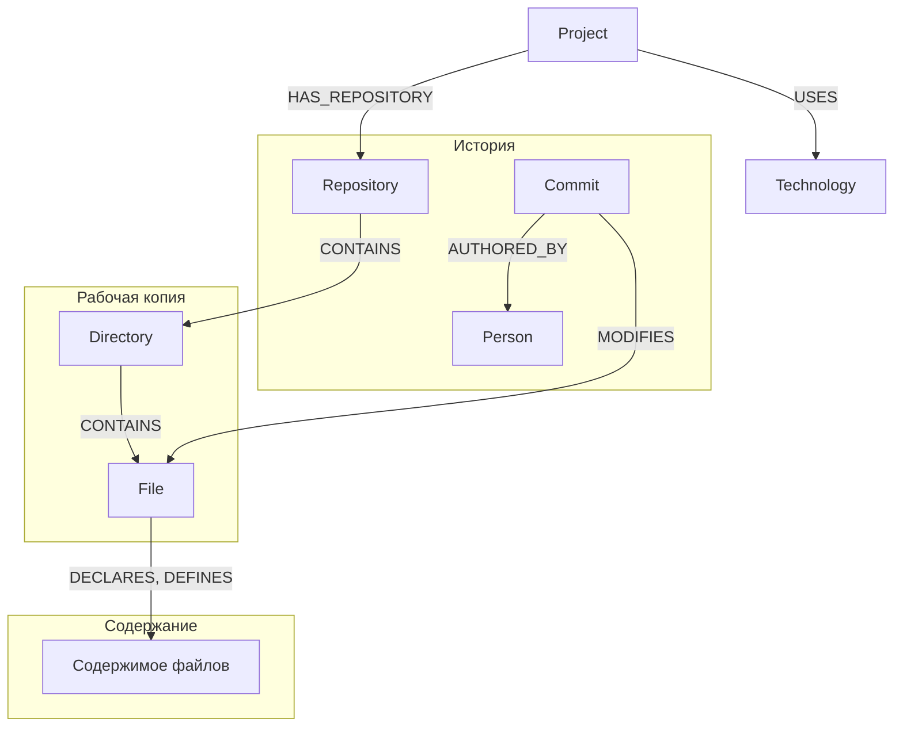
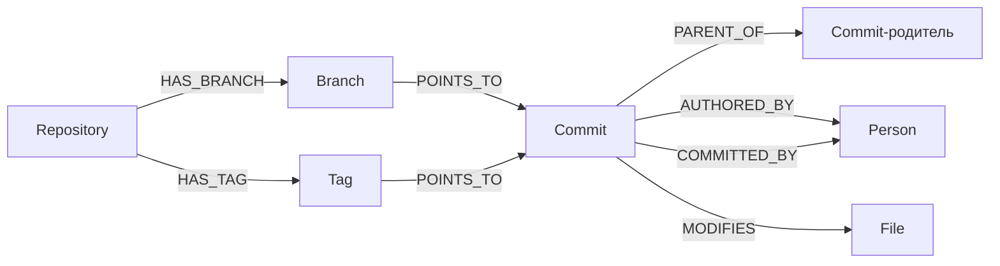
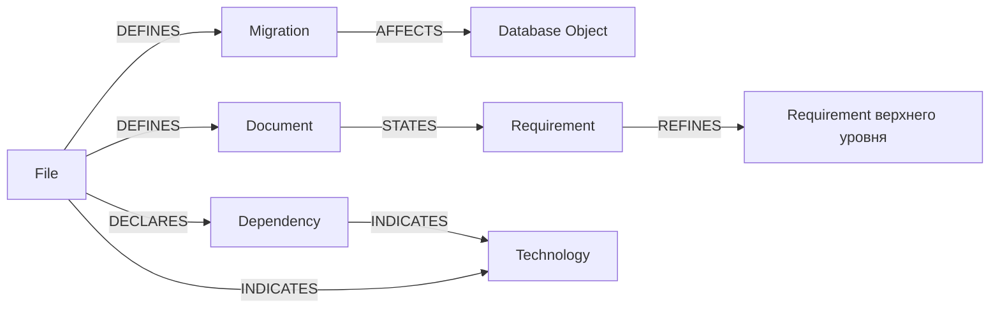
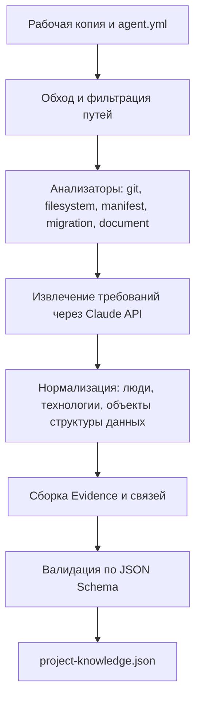
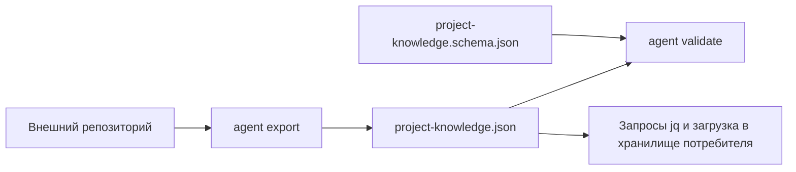

# ТЗ: агент сбора проектных знаний

Техническое задание на первую версию агента, который обходит рабочую копию программного проекта,
собирает факты о нём из git, файловой системы, манифестов зависимостей, миграций и документации
и выгружает их одним файлом `project-knowledge.json`, валидным по JSON Schema.

---

## Навигация

- [Цель](#цель)
- [Область первой версии](#область-первой-версии)
- [Термины](#термины)
- [Модель данных](#модель-данных)
- [Структура сущностей](#структура-сущностей)
- [Связи](#связи)
- [Схема](#схема)
- [Ключевое правило предметной области](#ключевое-правило-предметной-области)
- [Канонический вход](#канонический-вход)
- [Конвейер обработки](#конвейер-обработки)
- [Валидация](#валидация)
- [Нормализация и разрешение дублей](#нормализация-и-разрешение-дублей)
- [Требования к идентификаторам](#требования-к-идентификаторам)
- [Экспорт и импорт](#экспорт-и-импорт)
- [Минимальный интерфейс](#минимальный-интерфейс)
- [Ключевые запросы](#ключевые-запросы)
- [Ограничения и допущения](#ограничения-и-допущения)
- [Критерии готовности](#критерии-готовности)
- [Результат первой версии](#результат-первой-версии)
- [Версионирование](#версионирование)

---

## Цель

Реализуется локальный агент командной строки, который превращает рабочую копию программного проекта
в один машиночитаемый файл знаний о нём.

Система должна:

- принимать на вход путь к каталогу проекта и не требовать ничего, кроме прав на чтение этого каталога;
- собирать историю изменений из git: репозиторий, ветки, теги, коммиты, участников, изменённые файлы;
- собирать структуру рабочей копии: каталоги, файлы, расширения, размеры, хэши содержимого;
- собирать объявленные зависимости из манифестов пакетных менеджеров;
- собирать миграции и изменения структуры данных, которые они описывают;
- собирать документы проекта и извлекать из них требования средствами Large Language Model (LLM);
- определять технологии проекта по собранным фактам, не имея зашитого перечня технологий в ядре;
- сохранять для каждого факта его источник — файл, коммит, анализатор, версию анализатора и время сбора;
- выгружать результат одним файлом `project-knowledge.json`, соответствующим `project-knowledge.schema.json`;
- давать на повторном прогоне того же состояния репозитория тот же результат, кроме отметки времени.

> **Важно:** источник истины — рабочая копия проекта, а не файл знаний. `project-knowledge.json` —
> производное представление, целиком пересобираемое из проекта при каждом запуске. Агент не хранит
> состояние между запусками, не ведёт базу данных и не поддерживает частичное обновление файла знаний.

Второй принцип, столь же обязательный: любой факт в выгрузке подтверждён Evidence. Факт, для которого
анализатор не может назвать источник, в выгрузку не попадает — см. раздел
[Ключевое правило предметной области](#ключевое-правило-предметной-области).

---

## Область первой версии

### Входит

- Командный интерфейс из двух операций: `export` и `validate`.
- Анализатор git: репозиторий, ветки, теги, коммиты, авторы, коммитеры, сообщения, даты, изменённые файлы.
- Анализатор файловой системы: каталоги, файлы, пути, расширения, размеры, `sha256` содержимого.
- Анализатор зависимостей для шести форматов манифестов: `pyproject.toml`, `requirements.txt`,
  `package.json`, `composer.json`, `go.mod`, `Cargo.toml`.
- Анализатор миграций для двух форматов: SQL-файлы каталога миграций и миграции Alembic.
- Анализатор документации для двух форматов: Markdown (`.md`) и reStructuredText (`.rst`).
- Извлечение требований из документов через Claude API с фиксацией модели и версии промпта в Evidence.
- Определение технологий по правилам, заданным словарём технологий вне ядра.
- Единая коллекция связей `relationships` с направлением и типом.
- Evidence для каждой сущности и каждой связи.
- JSON Schema `project-knowledge.schema.json` и проверка выгрузки по ней.
- Кэш ответов LLM на диске, обеспечивающий повторяемость прогона.

### Не входит

- Разбор исходного кода: сущности `Module`, `Package`, `Class`, `Interface`, `Trait`, `Enum`,
  `Function`, `Method` в первой версии не собираются, ключа `code_entities` в выгрузке нет.
- Выделение компонентов и слоёв архитектуры: ключа `components` в выгрузке нет — компонент выводится
  из структуры кода, которая в первой версии не разбирается.
- Постоянное хранилище знаний: база данных, графовая база, сервер и Graph API не создаются.
- Инкрементальный сбор: обновление ранее выгруженного файла по изменившимся коммитам не поддерживается,
  каждый запуск пересобирает файл целиком.
- Работа с удалёнными репозиториями: агент не выполняет `clone`, `fetch` и `pull`, анализируется только
  рабочая копия на локальном диске.
- Анализ артефактов сборки, контейнеров и конфигураций развёртывания: `Dockerfile`, `docker-compose.yml`,
  манифесты Kubernetes и файлы CI в первой версии обрабатываются только как файлы, сущностей не порождают.
- Веб-интерфейс, визуализация графа и любые формы отображения результата.
- Многопроектный режим: за один запуск обрабатывается один каталог проекта.

> **Внимание:** ключи `code_entities` и `components`, присутствовавшие в исходном черновике, исключены
> из версии схемы `1.0` вместе с анализом исходного кода. Они вводятся версией схемы `1.1`, когда
> появится первый анализатор кода; контракт анализатора описан разделом
> [Конвейер обработки](#конвейер-обработки) заранее, чтобы это расширение не меняло ядро.

---

## Термины

Имена сущностей приводятся на английском как термины без устоявшегося перевода: они же являются именами
типов в выгрузке и в JSON Schema. В прозе документа используется русское соответствие термина, в именах
полей, идентификаторов и типов — английское. Сокращения BR, FR, NFR, UC, US, AC раскрыты в перечне
ниже и попадают в выгрузку только полем `external_code` требования, когда встречаются в исходном
документе; значения поля `type` требования записываются словами — `business`, `functional` и далее
по перечню раздела [Структура сущностей](#структура-сущностей).

- **Project** — программный проект целиком, корневая сущность выгрузки; ровно один на файл знаний.
- **Repository** — git-репозиторий рабочей копии, из которого собирается история изменений.
- **Branch** — именованная ветка репозитория, указывающая на коммит.
- **Tag** — именованная метка репозитория, указывающая на коммит.
- **Commit** — зафиксированное изменение в истории репозитория.
- **Person** — участник разработки: автор либо коммитер коммита.
- **Directory** — каталог рабочей копии.
- **File** — файл рабочей копии.
- **Technology** — технология проекта: язык, framework, СУБД, инструмент.
- **Dependency** — внешний пакет, объявленный в манифесте пакетного менеджера.
- **Migration** — файл миграции, описывающий изменение структуры данных.
- **Database Object** — объект структуры данных, затронутый миграцией: таблица, колонка, индекс, ограничение.
- **Document** — документ проекта в текстовом формате разметки.
- **Requirement** — требование, извлечённое из документа: Business Requirement (BR), Functional Requirement
  (FR), Non-Functional Requirement (NFR), Use Case (UC), User Story (US), Acceptance Criterion (AC).
- **Relationship** — направленная связь между двумя сущностями выгрузки.
- **Evidence** — запись об источнике факта: чем, откуда, когда и какой версией анализатора он получен.
- **Анализатор (Analyzer)** — модуль сбора фактов из одного вида источника; подключается к ядру
  по общему контракту.
- **Файл знаний (Project Knowledge File)** — файл выгрузки `project-knowledge.json`.

Глоссарий проекта project-snapshot отсутствует, поэтому термины настоящего документа объявляются каноническими
в его пределах; это зафиксировано в разделе [Ограничения и допущения](#ограничения-и-допущения).

---

## Модель данных

Модель имеет четыре уровня: от проекта к файлам рабочей копии, от файлов — к фактам, извлечённым
из их содержимого, и поперёк всех уровней — подтверждения источников.

```text
Уровень 1. Project
Уровень 2. Repository → Branch, Tag, Commit → Person
Уровень 3. Directory → File
Уровень 4. File → Dependency, Migration → Database Object, Document → Requirement
Поперёк:   Technology (выводится), Relationship (связи), Evidence (подтверждения)
```

Хранилище — один JSON-файл; единицей хранения является корневой ключ выгрузки. Полный перечень
корневых ключей версии схемы `1.0`:

- `schema_version`
- `generated_at`
- `filters`
- `project`
- `repositories`
- `branches`
- `tags`
- `commits`
- `people`
- `directories`
- `files`
- `technologies`
- `dependencies`
- `migrations`
- `database_objects`
- `documents`
- `requirements`
- `relationships`
- `evidence`

Ключ `project` содержит один объект, `schema_version` и `generated_at` — строки, `filters` — объект
с двумя списками строк, `authors` и `exclude`, описывающий применённую выборку, остальные ключи —
массивы объектов. Пустой массив допустим и означает, что соответствующих фактов в проекте не найдено;
отсутствие ключа недопустимо.

---

## Структура сущностей

Каждая сущность описывается по единому шаблону: корневой ключ выгрузки, пример объекта с доменными
значениями, перечень обязательных полей, требования и запреты. Поле `id` обязательно у всех сущностей
и формируется по правилам раздела [Требования к идентификаторам](#требования-к-идентификаторам).
Поле `evidence_ids` обязательно у всех сущностей, кроме самой Evidence, и содержит не менее
одного идентификатора Evidence.

### Project

Ключ выгрузки: `project`. Объект единственный.

```json
{
  "id": "project:billing-gateway",
  "name": "Billing Gateway",
  "slug": "billing-gateway",
  "root_path": "/srv/projects/billing-gateway",
  "description": "Платёжный шлюз для подписок B2B-клиентов",
  "agent_version": "1.0.0",
  "evidence_ids": ["evidence:2f5c1ab9d4e70c83"]
}
```

Обязательные поля: `id`, `name`, `slug`, `root_path`, `agent_version`, `evidence_ids`.

Требования:

- `name` берётся из ключа `project.name` файла конфигурации; при отсутствии конфигурации — имя корневого
  каталога рабочей копии;
- `slug` образуется из `name` по правилу нормализации идентификаторов и совпадает с суффиксом `id`;
- `root_path` записывается абсолютным путём и не участвует в формировании идентификаторов;
- `description` опционально и заполняется только из ключа `project.description` конфигурации.

Запреты: агрегированные показатели проекта — число файлов, число коммитов, доли языков — полями Project
не являются и в выгрузку не пишутся; они вычисляются по массивам выгрузки потребителем.

### Repository

Ключ выгрузки: `repositories`.

```json
{
  "id": "repository:billing-gateway",
  "name": "billing-gateway",
  "path": ".",
  "remote_url": "git@github.com:acme/billing-gateway.git",
  "default_branch": "main",
  "head_commit_id": "commit:9f3c1d2a7b48e5f0c6d1a2b3c4d5e6f708192a3b",
  "is_dirty": false,
  "evidence_ids": ["evidence:8c1d0e4f7a2b3c5d"]
}
```

Обязательные поля: `id`, `name`, `path`, `default_branch`, `head_commit_id`, `is_dirty`, `evidence_ids`.

Требования:

- `path` записывается относительно `project.root_path`; для репозитория в корне проекта — `"."`;
- `remote_url` опционально: заполняется значением `remote.origin.url`, если удалённый репозиторий задан;
- `is_dirty` истинно, когда в рабочей копии есть незакоммиченные изменения; значение попадает
  в предупреждения прогона, но сбор не останавливает;
- при отсутствии каталога `.git` анализатор git не выполняется, массив `repositories` остаётся пустым,
  остальные анализаторы работают;
- в репозитории без коммитов `head_commit_id` равен `null`, массивы `commits`, `branches` и `tags`
  остаются пустыми;
- при выборке по автору `head_commit_id` равен `null`, если коммит HEAD не попал в выгрузку; ветки
  и теги, указывающие на невключённые коммиты, не создаются, а попадают в предупреждения прогона.

Запреты: содержимое файлов, diff коммитов и объекты git в Repository не дублируются.

### Branch и Tag

Ключи выгрузки: `branches`, `tags`. Структура объектов одинакова, различается тип идентификатора.

```json
{
  "id": "branch:billing-gateway/main",
  "repository_id": "repository:billing-gateway",
  "name": "main",
  "commit_id": "commit:9f3c1d2a7b48e5f0c6d1a2b3c4d5e6f708192a3b",
  "is_default": true,
  "evidence_ids": ["evidence:5b7e2c1a9d3f4068"]
}
```

```json
{
  "id": "tag:billing-gateway/v2.4.0",
  "repository_id": "repository:billing-gateway",
  "name": "v2.4.0",
  "commit_id": "commit:41a8b7c6d5e4f3021a9b8c7d6e5f40312a1b0c9d",
  "message": "Релиз 2.4.0: тарифы с почасовой тарификацией",
  "evidence_ids": ["evidence:0a1b2c3d4e5f6071"]
}
```

Обязательные поля Branch: `id`, `repository_id`, `name`, `commit_id`, `is_default`, `evidence_ids`.
Обязательные поля Tag: `id`, `repository_id`, `name`, `commit_id`, `evidence_ids`.

Требования:

- собираются только локальные ветки; удалённые ветки (`refs/remotes/`) пропускаются;
- `message` заполняется только для аннотированных тегов, у легковесных тегов поле отсутствует;
- ровно одна ветка репозитория имеет `is_default: true` — та, что названа в `default_branch`.

### Commit

Ключ выгрузки: `commits`.

```json
{
  "id": "commit:9f3c1d2a7b48e5f0c6d1a2b3c4d5e6f708192a3b",
  "repository_id": "repository:billing-gateway",
  "sha": "9f3c1d2a7b48e5f0c6d1a2b3c4d5e6f708192a3b",
  "short_sha": "9f3c1d2",
  "subject": "BG-214: добавить почасовую тарификацию подписок",
  "message": "BG-214: добавить почасовую тарификацию подписок\n\nТариф считается по часам простоя.",
  "authored_at": "2026-07-14T11:02:37Z",
  "committed_at": "2026-07-14T11:02:37Z",
  "author_id": "person:m.orlova@acme.dev",
  "committer_id": "person:m.orlova@acme.dev",
  "parent_ids": ["commit:41a8b7c6d5e4f3021a9b8c7d6e5f40312a1b0c9d"],
  "is_merge": false,
  "changes": [
    {
      "path": "src/billing/hourly_rate.py",
      "change_type": "added",
      "insertions": 84,
      "deletions": 0
    },
    {
      "path": "src/billing/subscription.py",
      "change_type": "modified",
      "insertions": 12,
      "deletions": 3
    }
  ],
  "evidence_ids": ["evidence:6d4c3b2a1908f7e6"]
}
```

Обязательные поля: `id`, `repository_id`, `sha`, `short_sha`, `subject`, `message`, `authored_at`,
`committed_at`, `author_id`, `committer_id`, `parent_ids`, `is_merge`, `changes`, `evidence_ids`.

Требования:

- `sha` — полный сорокасимвольный hex; `short_sha` — первые семь символов `sha`;
- `subject` — первая строка сообщения; `message` — сообщение целиком, включая первую строку;
- даты записываются в UTC по ISO 8601 с суффиксом `Z`;
- `parent_ids` пуст для корневого коммита; `is_merge` истинно при двух и более родителях в самой
  истории, а не в выгрузке;
- при выборке по автору `parent_ids` содержит только коммиты, попавшие в выгрузку: ссылка обязана
  указывать на существующий объект, поэтому перечень усекается, а `is_merge` сохраняет исходное
  значение;
- `change_type` принимает значения закрытого перечня: `added`, `modified`, `deleted`, `renamed`, `copied`;
- при `change_type: "renamed"` в элементе `changes` дополнительно присутствует `previous_path`;
- для коммитов слияния `changes` вычисляется относительно первого родителя.

Запреты: элемент `changes` остаётся полем коммита и самостоятельной сущностью не выделяется — отдельного
объекта «изменение файла» в модели нет. Текст diff в выгрузку не попадает.

### Person

Ключ выгрузки: `people`.

```json
{
  "id": "person:m.orlova@acme.dev",
  "name": "Мария Орлова",
  "email": "m.orlova@acme.dev",
  "aliases": [
    {"name": "Maria Orlova", "email": "m.orlova@acme.dev"},
    {"name": "morlova", "email": "m.orlova@acme.dev"}
  ],
  "evidence_ids": ["evidence:aa11bb22cc33dd44"]
}
```

Обязательные поля: `id`, `name`, `email`, `aliases`, `evidence_ids`.

Требования:

- сущность создаётся один раз на адрес электронной почты, приведённый к нижнему регистру;
- `name` — написание из самого позднего по `authored_at` коммита участника; при совпадении дат
  выбирается больший `sha`, иначе результат зависел бы от порядка обхода истории;
- все прочие встреченные пары «имя, адрес» перечисляются в `aliases`, включая написание из `name`;
- участник без адреса в коммите получает `email: ""` и идентификатор по имени.

Запреты: роль участника (автор, коммитер) полем Person не является — она выражена типом связи.

### Directory и File

Ключи выгрузки: `directories`, `files`.

```json
{
  "id": "directory:billing-gateway/src/billing",
  "repository_id": "repository:billing-gateway",
  "path": "src/billing",
  "name": "billing",
  "parent_id": "directory:billing-gateway/src",
  "evidence_ids": ["evidence:1122334455667788"]
}
```

```json
{
  "id": "file:billing-gateway/src/billing/hourly_rate.py",
  "repository_id": "repository:billing-gateway",
  "path": "src/billing/hourly_rate.py",
  "name": "hourly_rate.py",
  "extension": "py",
  "directory_id": "directory:billing-gateway/src/billing",
  "size_bytes": 4213,
  "sha256": "3b1f9e0c7d5a48261bf03c9e7a4d2b5081c6f7e394a0d2b8c1e5f60738a9b4c2",
  "is_binary": false,
  "role": "source",
  "evidence_ids": ["evidence:99aabbccddeeff00"]
}
```

Обязательные поля Directory: `id`, `repository_id`, `path`, `name`, `parent_id`, `evidence_ids`;
у каталога верхнего уровня `parent_id` равен идентификатору репозитория, а в проекте без репозитория —
идентификатору проекта.

Обязательные поля File: `id`, `repository_id`, `path`, `name`, `extension`, `directory_id`,
`size_bytes`, `sha256`, `is_binary`, `role`, `evidence_ids`.

Требования:

- обходится рабочая копия на диске; файлы, отфильтрованные `.gitignore` и списком `exclude`
  конфигурации, пропускаются вместе с содержащими их каталогами; правила `.gitignore` применяются
  только при наличии репозитория — без него действует лишь список `exclude`;
- собственные файлы прогона не собираются: файл выгрузки, указанный `--output`, и каталог кэша
  `.agent-cache` исключаются из обхода, иначе повторный прогон видел бы результат предыдущего
  и не был бы воспроизводим;
- имена файлов и каталогов собираются в исходном виде, включая не-ASCII символы и пробелы;
  файл, имя которого не является корректным UTF-8, пропускается с предупреждением;
- `repository_id` каталога и файла равен `null` в проекте без репозитория; в этом случае каталог
  верхнего уровня принадлежит проекту, что выражается связью `CONTAINS` от `project`;
- каталог `.git` не обходится ни при каких настройках;
- `extension` записывается без точки и в нижнем регистре; допустим любой символ, кроме разделителя
  пути, — расширение берётся из имени файла как есть, включая случаи вида `php~`; у файла
  без расширения — `""`;
- `sha256` считается по содержимому файла целиком, независимо от размера;
- `is_binary` истинно, если в первых 8192 байтах файла встречается нулевой байт;
- `role` принимает значения расширяемого перечня: `source`, `manifest`, `migration`, `documentation`,
  `configuration`, `test`, `asset`, `other`; правила отнесения задаются словарём технологий;
- файл может иметь только одну роль; при совпадении нескольких правил применяется первое по порядку
  в словаре.

Запреты: содержимое файла в выгрузку не пишется — ни целиком, ни фрагментами; текстовые фрагменты
попадают в выгрузку только как поля Requirement.

### Technology

Ключ выгрузки: `technologies`.

```json
{
  "id": "technology:postgresql",
  "name": "PostgreSQL",
  "slug": "postgresql",
  "category": "database",
  "version": "16.2",
  "confidence": "declared",
  "evidence_ids": ["evidence:4455667788990011", "evidence:1230984576abcdef"]
}
```

Обязательные поля: `id`, `name`, `slug`, `category`, `confidence`, `evidence_ids`.

Требования:

- перечень технологий в ядре не зашит: имена, категории и правила распознавания берутся из словаря
  технологий — файла данных, поставляемого с агентом и заменяемого через конфигурацию;
- `category` принимает значения расширяемого перечня: `language`, `framework`, `library`, `database`,
  `runtime`, `tool`, `platform`;
- `version` опционально и заполняется, только когда версия указана в источнике явно;
- `confidence` принимает значения закрытого перечня: `declared` — технология объявлена в манифесте
  или файле конфигурации; `inferred` — выведена по косвенному признаку, например по расширениям файлов;
- технология с `confidence: "inferred"` создаётся только при наличии не менее трёх подтверждающих файлов.

Запреты: одна технология не дублируется записями с разной категорией; варианты написания разрешаются
по словарю до создания сущности.

### Dependency

Ключ выгрузки: `dependencies`.

```json
{
  "id": "dependency:pypi/sqlalchemy",
  "ecosystem": "pypi",
  "name": "sqlalchemy",
  "version_constraint": ">=2.0,<3.0",
  "resolved_version": "2.0.31",
  "scope": "runtime",
  "manifest_file_id": "file:billing-gateway/pyproject.toml",
  "evidence_ids": ["evidence:5566778899aabbcc"]
}
```

Обязательные поля: `id`, `ecosystem`, `name`, `version_constraint`, `scope`, `manifest_file_id`,
`evidence_ids`.

Требования:

- `ecosystem` принимает значения закрытого для первой версии перечня: `pypi`, `npm`, `packagist`,
  `go`, `crates`;
- `version_constraint` записывается строкой в исходной нотации манифеста; при отсутствии ограничения — `"*"`;
- `resolved_version` опционально и заполняется только из lock-файла соответствующего формата;
- `scope` принимает значения закрытого перечня: `runtime`, `development`, `optional`;
- один и тот же пакет, объявленный в нескольких манифестах, даёт одну сущность Dependency
  и несколько записей Evidence.

Запреты: транзитивные зависимости не собираются — только объявленные в манифестах напрямую.

### Migration и Database Object

Ключи выгрузки: `migrations`, `database_objects`.

```json
{
  "id": "migration:billing-gateway/migrations/2026_07_14_add_hourly_rate.sql",
  "repository_id": "repository:billing-gateway",
  "file_id": "file:billing-gateway/migrations/2026_07_14_add_hourly_rate.sql",
  "identifier": "2026_07_14_add_hourly_rate",
  "format": "sql",
  "operations": [
    {
      "operation": "add_column",
      "object_kind": "column",
      "object_name": "subscription.hourly_rate",
      "details": "numeric(12,2) not null default 0"
    },
    {
      "operation": "create_index",
      "object_kind": "index",
      "object_name": "idx_subscription_hourly_rate",
      "details": "on subscription (hourly_rate)"
    }
  ],
  "evidence_ids": ["evidence:ccddeeff00112233"]
}
```

```json
{
  "id": "database_object:table/subscription",
  "kind": "table",
  "name": "subscription",
  "parent_id": null,
  "evidence_ids": ["evidence:ccddeeff00112233"]
}
```

Обязательные поля Migration: `id`, `repository_id`, `file_id`, `identifier`, `format`, `operations`,
`evidence_ids`.
Обязательные поля Database Object: `id`, `kind`, `name`, `parent_id`, `evidence_ids`.

Требования:

- `format` принимает значения закрытого для первой версии перечня: `sql`, `alembic`;
- `operation` принимает значения закрытого перечня: `create_table`, `alter_table`, `drop_table`,
  `add_column`, `alter_column`, `drop_column`, `create_index`, `drop_index`, `add_constraint`,
  `drop_constraint`;
- `kind` объекта структуры данных принимает значения закрытого перечня: `table`, `column`, `index`,
  `constraint`;
- `parent_id` колонки, индекса и ограничения ссылается на таблицу; у таблицы `parent_id` равен `null`;
- операция, которую анализатор не смог отнести к перечню, не создаёт ни элемента `operations`,
  ни Database Object, и попадает в предупреждения прогона.

Запреты: агент не выполняет миграции, не подключается к СУБД и не сверяет объекты с реальной схемой
базы данных — вся информация берётся из текста миграций.

### Document

Ключ выгрузки: `documents`.

```json
{
  "id": "document:billing-gateway/docs/requirements.md",
  "repository_id": "repository:billing-gateway",
  "file_id": "file:billing-gateway/docs/requirements.md",
  "title": "Требования к тарификации подписок",
  "format": "markdown",
  "language": "ru",
  "char_count": 18427,
  "headings": [
    "Бизнес-требования",
    "Функциональные требования",
    "Критерии приёмки"
  ],
  "evidence_ids": ["evidence:778899aabbccddee"]
}
```

Обязательные поля: `id`, `repository_id`, `file_id`, `title`, `format`, `language`, `char_count`,
`headings`, `evidence_ids`.

Требования:

- `format` принимает значения закрытого для первой версии перечня: `markdown`, `restructuredtext`;
- `title` берётся из заголовка первого уровня; при его отсутствии — имя файла без расширения;
- `language` записывается двухбуквенным кодом ISO 639-1 и определяется по преобладающему алфавиту;
- `headings` содержит заголовки первого и второго уровней в порядке их появления;
- документами считаются только файлы с `role: "documentation"`.

Запреты: полный текст документа в выгрузку не пишется; в выгрузку попадают заголовки и извлечённые
из документа требования.

### Requirement

Ключ выгрузки: `requirements`.

```json
{
  "id": "requirement:7c19a4f2b8e30d65",
  "document_id": "document:billing-gateway/docs/requirements.md",
  "type": "functional",
  "external_code": "FR-014",
  "title": "Пересчёт тарифа при смене плана",
  "statement": "При смене тарифного плана система пересчитывает стоимость текущего периода пропорционально числу часов, отработанных на каждом плане.",
  "source_heading": "Функциональные требования",
  "source_char_range": [8412, 8630],
  "extraction": {
    "method": "llm",
    "model": "claude-opus-5",
    "prompt_version": "1.0.0",
    "confidence": "high"
  },
  "evidence_ids": ["evidence:eeff001122334455"]
}
```

Обязательные поля: `id`, `document_id`, `type`, `title`, `statement`, `source_heading`,
`source_char_range`, `extraction`, `evidence_ids`.

Требования:

- `type` принимает значения закрытого перечня: `business`, `functional`, `non_functional`, `use_case`,
  `user_story`, `acceptance_criterion`;
- `external_code` опционально: заполняется, когда в тексте документа у требования есть собственный код
  вида `FR-014`, и переносится без изменений;
- `statement` — формулировка требования одним предложением, приведённая к утвердительной форме;
- `source_char_range` — пара «начало, конец» в символах исходного документа, по которой формулировка
  сверяется с источником;
- `extraction.method` принимает значения закрытого перечня: `llm`, `marker` — второе значение
  зарезервировано для детерминированного извлечения по кодам вида `FR-014` и в первой версии
  используется только для требований, у которых код найден разметкой до обращения к модели;
- `extraction.confidence` принимает значения закрытого перечня: `high`, `medium`, `low`; требования
  с `low` в выгрузку не попадают.

Запреты: требование не связывается с кодом, коммитом или файлом реализации — трассировка требований
на реализацию в первой версии не выполняется.

### Relationship

Ключ выгрузки: `relationships`. Все связи модели хранятся единообразно — одним массивом объектов
одинаковой структуры, независимо от типов концов связи.

```json
{
  "id": "relationship:3d5e7f9a1b2c4d60",
  "type": "AUTHORED_BY",
  "from_id": "commit:9f3c1d2a7b48e5f0c6d1a2b3c4d5e6f708192a3b",
  "to_id": "person:m.orlova@acme.dev",
  "attributes": {},
  "evidence_ids": ["evidence:6d4c3b2a1908f7e6"]
}
```

Обязательные поля: `id`, `type`, `from_id`, `to_id`, `attributes`, `evidence_ids`.

Требования:

- `type` принимает значения закрытого перечня, приведённого в разделе [Связи](#связи);
- `from_id` и `to_id` ссылаются на существующие в выгрузке сущности; типы концов соответствуют строке
  таблицы типов связей;
- `attributes` — объект дополнительных полей связи; пустой объект допустим и является значением
  по умолчанию;
- пара «`from_id`, `type`, `to_id`» уникальна: повторная связь не создаётся, а получает дополнительную
  запись Evidence.

Запреты: обратные связи не хранятся — для каждой пары сущностей хранится ровно одно направление,
заданное таблицей типов.

### Evidence

Ключ выгрузки: `evidence`.

```json
{
  "id": "evidence:4455667788990011",
  "subject_id": "technology:postgresql",
  "subject_type": "technology",
  "source_kind": "manifest",
  "source_file_id": "file:billing-gateway/pyproject.toml",
  "source_locator": "project.dependencies[7]",
  "source_commit_id": null,
  "analyzer": "dependencies.pypi",
  "analyzer_version": "1.0.0",
  "collected_at": "2026-08-24T09:15:44Z"
}
```

Обязательные поля: `id`, `subject_id`, `subject_type`, `source_kind`, `analyzer`, `analyzer_version`,
`collected_at`.

Требования:

- `subject_id` ссылается на сущность или связь, факт существования которой подтверждается записью;
- `subject_type` дублирует тип субъекта строкой и совпадает с префиксом `subject_id`;
- `source_kind` принимает значения закрытого перечня: `git`, `filesystem`, `manifest`, `migration`,
  `document`, `llm`;
- `source_file_id` обязателен при `source_kind` из набора `manifest`, `migration`, `document`, `llm`:
  факт таких видов всегда лежит внутри файла. Для `source_kind: "git"` допустим `null`. Для
  `source_kind: "filesystem"` обязателен либо `source_file_id`, либо `source_locator`: источником
  Project и Directory является место в рабочей копии, у которого нет сущности File, и точное место
  указывает `source_locator`;
- `source_commit_id` обязателен при `source_kind: "git"`, для остальных значений — `null`;
- `source_locator` — точное место факта в источнике: путь к ключу манифеста, номер строки, диапазон
  символов; при недоступности точного места — `null`;
- для `source_kind: "llm"` в записи дополнительно присутствуют `model` и `prompt_version` с теми же
  значениями, что и в поле `extraction` требования.

Запреты: Evidence не удаляется и не переиспользуется между субъектами — одна запись подтверждает ровно
один факт у ровно одного субъекта.

---

## Связи

Связи хранятся единообразно: один массив `relationships`, одна структура объекта, тип связи —
значение поля `type`. Отдельных массивов под отдельные виды связей в модели нет.

| Тип | Откуда | Куда | Смысл |
|-----|--------|------|-------|
| `HAS_REPOSITORY` | `project` | `repository` | проект содержит репозиторий |
| `HAS_COMMIT` | `repository` | `commit` | репозиторий содержит коммит |
| `HAS_BRANCH` | `repository` | `branch` | репозиторий содержит ветку |
| `HAS_TAG` | `repository` | `tag` | репозиторий содержит тег |
| `POINTS_TO` | `branch` | `commit` | ветка указывает на коммит |
| `POINTS_TO` | `tag` | `commit` | тег указывает на коммит |
| `PARENT_OF` | `commit` | `commit` | родительский коммит предшествует дочернему |
| `AUTHORED_BY` | `commit` | `person` | коммит написан участником |
| `COMMITTED_BY` | `commit` | `person` | коммит зафиксирован участником |
| `MODIFIES` | `commit` | `file` | коммит изменил файл |
| `CONTAINS` | `project` | `directory` | проект без репозитория содержит каталог верхнего уровня |
| `CONTAINS` | `repository` | `directory` | репозиторий содержит каталог верхнего уровня |
| `CONTAINS` | `directory` | `directory` | каталог содержит вложенный каталог |
| `CONTAINS` | `directory` | `file` | каталог содержит файл |
| `DECLARES` | `file` | `dependency` | манифест объявляет зависимость |
| `DEFINES` | `file` | `migration` | файл определяет миграцию |
| `DEFINES` | `file` | `document` | файл определяет документ |
| `AFFECTS` | `migration` | `database_object` | миграция изменяет объект структуры данных |
| `BELONGS_TO` | `database_object` | `database_object` | колонка, индекс или ограничение принадлежит таблице |
| `STATES` | `document` | `requirement` | документ формулирует требование |
| `REFINES` | `requirement` | `requirement` | требование уточняет требование более высокого уровня |
| `VERIFIES` | `requirement` | `requirement` | критерий приёмки проверяет требование |
| `USES` | `project` | `technology` | проект использует технологию |
| `INDICATES` | `dependency` | `technology` | зависимость указывает на технологию |
| `INDICATES` | `file` | `technology` | файл указывает на технологию |

Направление задано таблицей и не меняется от источника: связь `MODIFIES` всегда идёт от коммита
к файлу, обратная связь «файл изменён коммитом» в выгрузке не хранится.

Атрибуты связей, отличные от пустого объекта, определены для двух типов:

- `MODIFIES` — `change_type`, `insertions`, `deletions`, повторяющие элемент `changes` коммита;
- `INDICATES` — `rule`, имя правила словаря технологий, по которому сделан вывод.

---

## Схема

Модель целиком: смысловые группы показаны через `subgraph`, группировка существует только в документе
и в хранилище не выражена — все сущности лежат в плоских массивах выгрузки.



Уровень истории изменений детально:



Уровень содержания файлов детально:



Каждый прямоугольник диаграмм соответствует одному типу объектов выгрузки и одному корневому ключу:
`Repository` — элементу массива `repositories`, `Commit` — элементу `commits`, `Person` — элементу
`people`; полный перечень соответствий даёт раздел [Модель данных](#модель-данных). Каждая
подписанная стрелка соответствует строке таблицы типов связей и элементу массива `relationships`.
Сущность `Evidence` на диаграммах не показана: она подтверждает каждую сущность и каждую связь и
загромождала бы схему — её место в модели описано разделом
[Ключевое правило предметной области](#ключевое-правило-предметной-области).

---

## Ключевое правило предметной области

Инвариант центральной сущности выгрузки — Evidence: каждый факт подтверждён источником.

```text
Факт обнаружен анализатором
   ↓
Анализатор называет источник: вид, файл, точное место, коммит
   ↓
Создаётся запись Evidence с именем и версией анализатора
   ↓
Идентификатор Evidence добавляется в evidence_ids сущности или связи
   ↓
Факт попадает в выгрузку
```

Обратный ход правила и есть его смысл: факт, для которого анализатор не может назвать источник,
в выгрузку не попадает — ни с пустым `evidence_ids`, ни с записью Evidence без `source_kind`.
Массив `evidence_ids` длины ноль недопустим для любой сущности, кроме записей Evidence, и для любой
связи, что проверяется
валидацией и делает нарушение правила ошибкой прогона, а не молчаливой потерей качества.

Структура даёт три свойства:

- любое утверждение выгрузки проверяемо вручную: по `source_file_id` и `source_locator` открывается
  исходное место в проекте;
- вклад каждого анализатора отделим: факты, собранные конкретным анализатором конкретной версии,
  выбираются фильтром по `analyzer` и `analyzer_version`;
- выводимые факты отличимы от объявленных: технология с `confidence: "inferred"` и требование
  с `extraction.method: "llm"` несут в Evidence способ получения и не смешиваются с фактами,
  прочитанными из манифеста напрямую.

---

## Канонический вход

Единственный вход агента — рабочая копия проекта на локальном диске, путь к которой передан аргументом
команды `export`. Дополнительно агент читает необязательный файл конфигурации `agent.yml` в корне
рабочей копии.

Корневые ключи файла конфигурации:

```yaml
project:
  name: Billing Gateway
  description: Платёжный шлюз для подписок B2B-клиентов
exclude:
  - vendor/
  - node_modules/
  - "*.min.js"
technologies:
  dictionary: ./tech-dictionary.yml
requirements:
  enabled: true
  model: claude-opus-5
  max_document_chars: 100000
history:
  authors:
    - a.gaibovich@tradeium.digital
identities:
  Гайбович Алексей: a.gaibovich@tradeium.digital, alexgaib@mail.ru
```

Правила чтения конфигурации:

- файл необязателен: при его отсутствии применяются значения по умолчанию, а `project.name`
  берётся из имени корневого каталога;
- `exclude` дополняет правила `.gitignore`, но не отменяет их; шаблон, оканчивающийся на `/`,
  исключает каталог с таким путём и любой одноимённый каталог на любом уровне вложенности,
  остальные шаблоны сопоставляются с путём от корня и с именем файла;
- значения флага `--exclude` добавляются к списку `exclude` конфигурации, а не заменяют его:
  исключить каталоги можно, не создавая файл в чужом проекте;
- `technologies.dictionary` указывает на замену словаря технологий, поставляемого с агентом;
- `history.authors` ограничивает историю коммитами перечисленных авторов: значение сопоставляется
  подстрокой с именем и адресом почты, регистр не учитывается, несколько значений соединяются
  по «или»; пустой список означает всю историю;
- `identities` задаёт карту тождества участников: ключ — каноническое имя человека, значение —
  его адреса через запятую либо списком; допускается и форма списка записей с ключами `name`,
  `emails` и `names`;
- `requirements.enabled: false` отключает обращение к модели; выгрузка формируется без требований;
- неизвестный ключ конфигурации является ошибкой запуска: агент завершается, ничего не записав.

> **Важно:** вход единственный. Агент не принимает данные из других источников — ни из аргументов
> командной строки помимо пути и флагов, ни из переменных окружения помимо ключа доступа к Claude API,
> ни из ранее выгруженного файла знаний. Создание сущностей в обход анализаторов запрещено: в выгрузке
> нет полей и объектов, заполняемых вручную.

---

## Конвейер обработки



Шаги конвейера:

1. **Обход и фильтрация.** Строится перечень путей рабочей копии с учётом `.gitignore`, списка
   `exclude`, безусловного пропуска каталога `.git` и собственных файлов прогона — файла выгрузки
   и каталога `.agent-cache`.
2. **Сбор.** Каждый анализатор получает перечень путей и возвращает ядру плоский список фактов:
   сущности, связи и подтверждающие их Evidence. Анализаторы не обращаются друг к другу и не знают
   о существовании остальных.
3. **Извлечение требований.** Документы передаются в Claude API; ответ модели, ограниченный схемой
   структурированного вывода, превращается в сущности Requirement.
4. **Нормализация.** Участники сводятся по адресу электронной почты, технологии — по словарю,
   объекты структуры данных — по имени таблицы.
5. **Сборка.** Формируются идентификаторы, связи и записи Evidence; факт без источника отбрасывается
   с записью в предупреждения.
6. **Валидация.** Собранная структура проверяется по `project-knowledge.schema.json` и правилам
   раздела [Валидация](#валидация).
7. **Запись.** Файл записывается целиком одной операцией после успешной валидации.

Контракт анализатора одинаков для всех видов источников: на вход — корень рабочей копии, перечень путей
и конфигурация; на выход — списки сущностей, связей и Evidence, где каждый факт сопровождается именем
и версией анализатора. Ядро не содержит логики, специфичной для технологии: язык, framework и формат
манифеста известны только анализатору и словарю технологий. Новый анализатор добавляется реализацией
контракта и регистрацией в перечне анализаторов, без изменения ядра, схемы связей и формата выгрузки.

### Воспроизводимость

Повторный прогон на том же состоянии рабочей копии даёт тот же файл знаний с точностью до отметок
времени: совпадают состав и порядок элементов всех массивов и все идентификаторы. Отметок времени две —
`generated_at` выгрузки и `collected_at` записей Evidence; в пределах одного прогона все записи несут
одно и то же значение `collected_at`, равное `generated_at`. Сверка двух выгрузок выполняется после
обнуления обеих отметок.

Порядок элементов детерминирован: массивы сортируются по `id` в лексикографическом порядке перед
записью. Недетерминированность ответов модели снимается кэшем: ответ на документ сохраняется
в `.agent-cache/requirements/{sha256 документа}.json` рядом с выгрузкой, и при повторном прогоне
неизменённого документа модель не вызывается, а требования берутся из кэша. Кэш является ускорением
и гарантией повторяемости, но не источником истины: его удаление приводит к повторному обращению
к модели, результат которого может отличаться формулировками — это зафиксировано в разделе
[Ограничения и допущения](#ограничения-и-допущения).

### Обращение к Claude API

Извлечение требований выполняется официальным Python SDK `anthropic`; ответ модели ограничивается
схемой структурированного вывода, поэтому разбор свободного текста не требуется.

```python
response = client.messages.parse(
    model="claude-opus-5",
    max_tokens=16000,
    system=REQUIREMENTS_SYSTEM_PROMPT,
    messages=[{"role": "user", "content": document_text}],
    output_format=ExtractedRequirements,
)
requirements = response.parsed_output.items
```

Правила вызова:

- модель по умолчанию — `claude-opus-5`; значение переопределяется ключом `requirements.model`
  конфигурации и записывается в `extraction.model` каждого требования и в Evidence;
- версия промпта задаётся константой агента, меняется вместе с текстом промпта и записывается
  в `extraction.prompt_version`;
- один вызов обрабатывает один документ целиком; документ длиннее `requirements.max_document_chars`
  (по умолчанию 100 000 символов) разбивается по заголовкам первого уровня, и каждая часть
  обрабатывается отдельным вызовом с собственным смещением `source_char_range`;
- содержимое документа не усекается: части покрывают текст полностью и без перекрытий;
- ключ доступа читается из переменной окружения `ANTHROPIC_API_KEY` и проверяется лениво — перед
  первым фактическим обращением к API, а не на старте прогона: документ, полностью покрытый кэшем,
  обрабатывается без ключа. Если ключа нет, а обратиться к API требуется, прогон
  завершается кодом `3` без записи файла;
- ошибки обращения к API — превышение лимита запросов и ответы с кодом 5xx — повторяются средствами
  SDK; исчерпание повторов завершает прогон кодом `3` без записи файла.

---

## Валидация

Проверки выполняются до записи файла и повторяются командой `validate` над готовым файлом.

**Обязательные поля.** У каждой сущности присутствуют поля, перечисленные в её карточке раздела
[Структура сущностей](#структура-сущностей), включая `id` и непустой `evidence_ids`. У выгрузки
присутствуют все корневые ключи раздела [Модель данных](#модель-данных).

**Форматы значений.**

- даты — ISO 8601 в UTC с суффиксом `Z`, например `2026-07-14T11:02:37Z`;
- `sha` коммита — сорок символов `[0-9a-f]`;
- `sha256` файла — шестьдесят четыре символа `[0-9a-f]`;
- `schema_version` — строка вида `{major}.{minor}`, для первой версии — `"1.0"`;
- `language` документа — двухбуквенный код ISO 639-1 в нижнем регистре;
- `size_bytes`, `insertions`, `deletions`, `char_count` — целые числа не меньше нуля.

**Закрытые перечни.** Значения полей `change_type`, `scope`, `ecosystem`, `format`, `operation`,
`kind`, `type` требования, `extraction.method`, `extraction.confidence`, `confidence` технологии,
`source_kind` и `type` связи принадлежат перечням, объявленным в разделе
[Структура сущностей](#структура-сущностей) и в таблице раздела [Связи](#связи).

**Логические ограничения.**

- `is_merge` истинно тогда и только тогда, когда длина `parent_ids` не меньше двух; при непустом
  `filters.authors` история усечена, и проверяется только обратное: коммит с двумя и более
  родителями в выгрузке помечен как слияние;
- ровно одна ветка репозитория имеет `is_default: true`, если у репозитория есть хотя бы одна ветка;
- `parent_id` объекта структуры данных с `kind: "table"` равен `null`, у остальных видов — не `null`;
- запись Evidence с `source_kind: "git"` имеет непустой `source_commit_id`; запись с `source_kind`
  из набора `manifest`, `migration`, `document`, `llm` — непустой `source_file_id`; запись
  с `source_kind: "filesystem"` — непустой `source_file_id` либо непустой `source_locator`;
- `source_char_range` требования — пара целых чисел, где первое меньше второго, а второе не превышает
  `char_count` документа.

**Ссылочная целостность.**

- каждый идентификатор в `from_id`, `to_id`, `evidence_ids`, `repository_id`, `directory_id`,
  `file_id`, `document_id`, `manifest_file_id`, `author_id`, `committer_id`, `parent_ids`,
  `commit_id`, `head_commit_id`, `subject_id` ссылается на существующий в выгрузке объект; значение
  `null` допустимо там, где оно разрешено карточкой сущности;
- типы концов каждой связи соответствуют строке таблицы типов связей;
- каждая сущность, кроме `project`, достижима из `project` хотя бы одной цепочкой связей.

**Уникальность.**

- `id` уникален в пределах всей выгрузки, а не только в пределах своего массива;
- тройка «`from_id`, `type`, `to_id`» уникальна среди связей;
- пара «`ecosystem`, `name`» уникальна среди зависимостей, `slug` уникален среди технологий.

**Поведение при непройденной проверке.** Файл знаний не записывается: команда `export` завершается
кодом `2`, сообщения об ошибках выводятся в стандартный поток ошибок списком «путь к полю — правило —
фактическое значение». Частичная выгрузка не создаётся, ранее существовавший файл по тому же пути
не изменяется и не удаляется. Команда `validate` над негодным файлом ведёт себя так же, но ничего
не пишет по определению.

**Предупреждения.** Факты, отброшенные из-за отсутствия источника, нераспознанные операции миграций
и требования с `extraction.confidence: "low"` не являются ошибками: они выводятся в стандартный поток
ошибок с префиксом `warning` и не влияют на код возврата.

---

## Нормализация и разрешение дублей

Нормализация выполняется до создания сущностей: дубли не появляются в выгрузке и не удаляются
из неё постфактум.

**Участники.** Ключ сведения — адрес электронной почты в нижнем регистре. Разные написания имени
с одним адресом дают одну сущность Person и несколько элементов `aliases`.

```text
Мария Орлова <M.Orlova@acme.dev>   ─┐
Maria Orlova <m.orlova@acme.dev>   ─┼─→  person:m.orlova@acme.dev
morlova <m.orlova@acme.dev>        ─┘
```

Разные адреса одного человека сводятся картой тождества — списком `identities` в конфигурации.
Запись карты задаёт каноническое имя человека и перечень его адресов; первый адрес становится
значением поля `email`, имя записи — значением `name`, а все встреченные пары «имя, адрес»
накапливаются в `aliases`.

```text
Гайбович Алексей: a.gaibovich@tradeium.digital, alexgaib@mail.ru, aleksey.gaybovich@lenvendo.ru
                          ↓
                  person:a.gaibovich@tradeium.digital
```

Правила разрешения:

- участник ищется в карте сначала по адресу — сравнение целиком, — затем по имени: имя записи
  сопоставляется подстрокой, поэтому запись `Alexey` сводит автора `Gaibovich Alexey`;
- короткое имя в карте сводит и посторонних с тем же фрагментом имени: надёжнее перечислять адреса,
  а имя оставлять как запасной признак;
- канонический адрес берётся из карты, даже если в истории он не встречался: карта задаёт, как
  человек представлен в выгрузке, а исходные учётные записи сохраняются в `aliases`;
- имя, заданное картой, каноническое: правило «написание из самого позднего коммита» его не меняет;
- отбор `--author` раскрывается по карте — образец, совпавший с любым адресом или именем записи,
  собирает коммиты всех её учётных записей;
- без карты действует прежнее правило: сведение только по полному совпадению адреса.

**Технологии.** Ключ сведения — `slug` из словаря технологий. Словарь задаёт каноническое имя,
категорию, перечень вариантов написания и правила распознавания.

```yaml
- slug: postgresql
  name: PostgreSQL
  category: database
  aliases: [postgres, psql, pg, PostgreSQL]
  rules:
    - kind: dependency
      ecosystem: pypi
      name: psycopg
    - kind: dependency
      ecosystem: pypi
      name: sqlalchemy
    - kind: file_glob
      pattern: "migrations/*.sql"
      min_matches: 3
```

Правило `kind: dependency` даёт технологию с `confidence: "declared"`, правило `kind: file_glob` —
с `confidence: "inferred"` и требует не менее `min_matches` совпадений. Технология, для которой
ни одно правило не сработало, не создаётся: расширение охвата выполняется дополнением словаря,
а не изменением кода.

**Объекты структуры данных.** Ключ сведения — пара «вид, имя», где имя таблицы приводится к нижнему
регистру, а имя колонки записывается как `таблица.колонка`. Миграция, изменяющая уже встреченную
таблицу, не создаёт вторую сущность, а добавляет связь `AFFECTS` и запись Evidence.

**Зависимости.** Ключ сведения — пара «`ecosystem`, `name`», имя приводится к нижнему регистру.
Один пакет, объявленный в манифесте и в lock-файле, даёт одну сущность и две записи Evidence.

**Требования.** Ключ сведения — `id`, вычисляемый от нормализованного текста формулировки. Одно
требование, повторённое в двух документах дословно, даёт одну сущность и две связи `STATES`.
Требования, различающиеся формулировкой, считаются разными и в первой версии не сводятся.

Уровень автоматизации первой версии: словарь технологий и правила сведения поставляются вместе
с агентом, ручное вмешательство в процессе прогона не предусмотрено; расширение словаря выполняется
редактированием файла данных.

---

## Требования к идентификаторам

Идентификатор сущности имеет вид `{тип}:{ключ}`, где `тип` — имя типа в нижнем регистре с подчёркиванием
в качестве разделителя слов.

Свойства идентификатора:

- **уникальность** — в пределах всей выгрузки, а не только в пределах массива своего типа;
- **стабильность** — при неизменной сущности идентификатор не меняется между прогонами и между
  версиями агента;
- **детерминированность** — вычисляется из содержания сущности, а не из порядка обхода, времени
  прогона или счётчика;
- **читаемость** — там, где у сущности есть естественный ключ, он используется напрямую, без хэша.

Правила формирования по типам:

| Тип | Ключ | Пример |
|-----|------|--------|
| `project` | `slug` проекта | `project:billing-gateway` |
| `repository` | `slug` репозитория | `repository:billing-gateway` |
| `branch`, `tag` | `{slug репозитория}/{имя ссылки}` | `branch:billing-gateway/main` |
| `commit` | полный `sha` | `commit:9f3c1d2a7b48e5f0c6d1a2b3c4d5e6f708192a3b` |
| `person` | адрес в нижнем регистре | `person:m.orlova@acme.dev` |
| `directory`, `file` | `{slug репозитория}/{путь от корня репозитория}` | `file:billing-gateway/src/billing/subscription.py` |
| `technology` | `slug` из словаря | `technology:postgresql` |
| `dependency` | `{ecosystem}/{имя пакета}` | `dependency:npm/react` |
| `migration` | `{slug репозитория}/{путь к файлу}` | `migration:billing-gateway/migrations/0007_add_index.sql` |
| `database_object` | `{вид}/{имя объекта}` | `database_object:column/subscription.hourly_rate` |
| `document` | `{slug репозитория}/{путь к файлу}` | `document:billing-gateway/README.md` |
| `requirement` | первые 16 символов `sha256` нормализованного текста | `requirement:7c19a4f2b8e30d65` |
| `relationship` | первые 16 символов `sha256` строки `{from_id}|{type}|{to_id}` | `relationship:3d5e7f9a1b2c4d60` |
| `evidence` | первые 16 символов `sha256` строки `{subject_id}|{source_kind}|{source_file_id}|{source_locator}|{analyzer}` | `evidence:4455667788990011` |

Сущности без естественного ключа — Requirement, Relationship, Evidence — получают идентификатор
от `sha256` своего содержания: нормализованного текста формулировки для требования и конкатенации
определяющих полей для связи и подтверждения. Нормализация текста перед хэшированием: приведение
к нижнему регистру, свёртка последовательностей пробельных символов в один пробел, удаление пробелов
по краям.

Участник без адреса электронной почты получает ключ `name/{slug имени}`, например
`person:name/ivan-petrov`; такой участник не сводится с одноимённым участником, у которого адрес есть.

---

## Экспорт и импорт

Выгрузка — один файл в кодировке UTF-8 с отступом в два пробела и переводом строки в конце файла.
По умолчанию файл создаётся в текущем рабочем каталоге.

```text
./
├── project-knowledge.json          выгрузка
├── project-knowledge.schema.json   схема, поставляемая с агентом
└── .agent-cache/
    └── requirements/
        └── {sha256 документа}.json ответы модели, кэш повторяемости
```

### Версионированное имя

Флаг `--versioned` заменяет постоянное имя файла именем версии выгрузки:

```text
Version{ГГГГММДДЧЧММСС}_{slug проекта}_export.json
Version20260824153553_billing-gateway_export.json
```

Правила именования:

- метка времени — та же отметка прогона, что записана в `generated_at`, в UTC и без разделителей;
- `slug проекта` — поле `project.slug` выгрузки;
- `--output` при `--versioned` задаёт каталог, а не имя файла; без `--output` файл создаётся
  в текущем рабочем каталоге;
- прежние версии, лежащие внутри анализируемого проекта, исключаются из обхода по шаблону
  `Version*_export.json` — иначе каждая новая выгрузка включала бы предыдущие;
- `--versioned` вместе с `--output -` игнорируется: выгрузка идёт в стандартный вывод, имени файла нет.

Версии не заменяют друг друга: каждый прогон создаёт отдельный файл, и очистка старых версий
остаётся за пользователем.

Структура выгрузки на верхнем уровне:

```json
{
  "schema_version": "1.0",
  "generated_at": "2026-08-24T09:15:42Z",
  "project": { "id": "project:billing-gateway" },
  "repositories": [],
  "branches": [],
  "tags": [],
  "commits": [],
  "people": [],
  "directories": [],
  "files": [],
  "technologies": [],
  "dependencies": [],
  "migrations": [],
  "database_objects": [],
  "documents": [],
  "requirements": [],
  "relationships": [],
  "evidence": []
}
```

Обратимость: файл, полученный командой `export`, проходит команду `validate` без ошибок. Повторный
`export` того же состояния рабочей копии даёт файл, отличающийся только отметками времени —
`generated_at` и `collected_at` записей Evidence; сравнение выгрузок с обнулёнными отметками даёт
пустой diff. Дубли при повторном прогоне не возникают, потому что идентификаторы детерминированы,
а массивы отсортированы по `id`.

Импорт выгрузки обратно в агент не предусмотрен: агент не читает `project-knowledge.json` как вход
и не поддерживает слияние выгрузок. Потребитель загружает файл в собственное хранилище средствами,
которые в область первой версии не входят.

---

## Минимальный интерфейс

Интерфейс — командная строка, две операции.

```text
agent export <путь-к-проекту> [--output <файл>] [--no-requirements] [--config <файл>]
                              [--exclude <шаблон>]... [--author <имя-или-почта>]...
                              [--identity <имя=почта,почта>]... [--versioned] [--quiet]
agent validate <файл-выгрузки> [--schema <файл>]
```

Ключевая операция — `export`: ради неё строится система. Она выполняет конвейер целиком и записывает
файл знаний.

| Флаг | Операция | Назначение |
|------|----------|------------|
| `--output` | `export` | путь результата, по умолчанию `./project-knowledge.json` |
| `--no-requirements` | `export` | пропустить обращение к модели, выгрузить факты без требований |
| `--config` | `export` | путь к файлу конфигурации вместо `agent.yml` в корне проекта |
| `--exclude` | `export` | исключить пути из обхода; флаг повторяется, значения дополняют список `exclude` конфигурации |
| `--author` | `export` | оставить в истории коммиты названных авторов; флаг повторяется, значения дополняют `history.authors` |
| `--identity` | `export` | свести учётные записи в одного человека в формате `Имя=почта,почта`; флаг повторяется, значения дополняют `identities` |
| `--versioned` | `export` | именовать выгрузку по шаблону версии; `--output` при этом задаёт каталог |
| `--quiet` | `export` | не выводить прогресс прогона |
| `--schema` | `validate` | путь к схеме вместо поставляемой с агентом |

Коды возврата — закрытый перечень:

| Код | Значение |
|-----|----------|
| `0` | операция выполнена, файл записан либо проверка пройдена |
| `1` | ошибка запуска: каталог недоступен, конфигурация неверна, аргументы неполны |
| `2` | валидация не пройдена, файл не записан |
| `3` | требования не извлечены: Claude API недоступен либо ключа доступа нет, а обращение требуется |

При коде `3` файл знаний не записывается; чтобы получить выгрузку без требований, прогон повторяется
с флагом `--no-requirements`. Прогон, все документы которого покрыты кэшем, кодом `3` не завершается:
ключ проверяется лениво, перед первым фактическим обращением к API. Прогресс сбора выводится
в стандартный поток ошибок, файл знаний — единственное, что попадает в стандартный поток вывода
при `--output -`. Прогресс называет этапы прогона — обход рабочей копии, чтение файлов, чтение
истории, разбор коммитов, сборка, валидация, запись, — а внутри длительных этапов не чаще раза
в секунду сообщает число обработанных элементов. Прогон завершается итоговой строкой с путём
выгрузки и числом собранных сущностей; флаг `--quiet` отключает весь этот вывод, не затрагивая
предупреждения и сообщения об ошибках.

---

## Ключевые запросы

Хранилище — файл, поэтому сценарии доступа выражаются запросами `jq` к выгрузке. Приведённые запросы
входят в приёмку и проверяются на выгрузке внешнего репозитория.

Технологии проекта с указанием, объявлены они или выведены:

```bash
jq -r '.technologies[] | "\(.name)\t\(.category)\t\(.confidence)"' project-knowledge.json
```

Участники по числу коммитов, от большего к меньшему:

```bash
jq -r '
  [.relationships[] | select(.type == "AUTHORED_BY") | .to_id]
  | group_by(.) | map({person: .[0], commits: length})
  | sort_by(-.commits)[] | "\(.commits)\t\(.person)"
' project-knowledge.json
```

Файлы, изменённые чаще всего:

```bash
jq -r '
  [.relationships[] | select(.type == "MODIFIES") | .to_id]
  | group_by(.) | map({file: .[0], changes: length})
  | sort_by(-.changes) | .[0:20][] | "\(.changes)\t\(.file)"
' project-knowledge.json
```

Требования одного типа с указанием документа-источника:

```bash
jq -r '
  .requirements[] | select(.type == "functional")
  | "\(.external_code // "—")\t\(.title)\t\(.document_id)"
' project-knowledge.json
```

Источники факта: все подтверждения одной технологии:

```bash
jq -r --arg id "technology:postgresql" '
  .evidence[] | select(.subject_id == $id)
  | "\(.source_kind)\t\(.source_file_id // .source_commit_id)\t\(.analyzer)"
' project-knowledge.json
```

Сценарий «история изменений одного файла» одним запросом не выражается: он требует обхода в два шага —
сначала отбираются связи `MODIFIES` с нужным `to_id`, затем по полученным `from_id` выбираются коммиты
и сортируются по `committed_at`.

```bash
jq -r --arg f "file:billing-gateway/src/billing/subscription.py" '
  [.relationships[] | select(.type == "MODIFIES" and .to_id == $f) | .from_id] as $ids
  | [.commits[] | select(.id | IN($ids[]))]
  | sort_by(.committed_at) | reverse | .[]
  | "\(.committed_at)\t\(.short_sha)\t\(.subject)"
' project-knowledge.json
```

---

## Ограничения и допущения

**Технологические ограничения.**

- Агент реализуется на Python версии 3.12 и старше, распространяется как пакет с консольной точкой
  входа `agent`. Ядро зависит только от стандартной библиотеки: проверка по JSON Schema выполняется
  собственной реализацией подмножества словаря схемы. Внешние зависимости добавляют лишь анализаторы —
  парсеры форматов манифестов и SDK `anthropic`. Файл `agent.yml` читается PyYAML, когда он
  установлен, иначе — встроенным разбором подмножества YAML: ключ со значением, секция вложенных
  ключей и список строк; иные конструкции YAML требуют PyYAML.
- Git читается через установленный в системе исполняемый файл `git`; при его отсутствии анализатор
  git не выполняется, а прогон продолжается по остальным источникам.
- Обращение к Claude API требует сетевого доступа и ключа в переменной окружения `ANTHROPIC_API_KEY`
  и выполняется только для документов, которых нет в кэше; значение ключа не выводится в журнал
  прогона, не попадает в выгрузку и не записывается в кэш.
- Производительность: на репозитории до 10 000 файлов и 20 000 коммитов команда `export` без извлечения
  требований выполняется не дольше 5 минут; время обращений к модели в этот показатель не входит
  и зависит от числа и объёма документов.
- Объём выгрузки не ограничивается: файл записывается целиком в память перед сериализацией, что
  на репозиториях свыше 100 000 файлов может потребовать более 2 ГБ оперативной памяти.

**Границы применимости.**

- Первая версия описывает систему без анализа исходного кода: выгрузка отвечает на вопросы об истории,
  структуре файлов, зависимостях, миграциях и требованиях, но не о структуре кода.
- Выгрузка содержит персональные данные участников разработки — имена и адреса электронной почты
  из git. Файл знаний обращается по тем же правилам, что и сам репозиторий.
- Один прогон обрабатывает один репозиторий. Монорепозиторий с вложенными каталогами `.git`
  обрабатывается как один репозиторий: вложенные репозитории не обходятся.
- Карта тождества задаётся вручную: агент не угадывает, что два адреса принадлежат одному человеку,
  и без записи в `identities` учётные записи остаются разными участниками.

**Принятые допущения.**

Допущение: проект содержит не более одного git-репозитория, находящегося в корне рабочей копии.
Следствие: массив `repositories` содержит не более одного элемента, а идентификаторы файлов
и каталогов используют `slug` единственного репозитория.
Если неверно: раздел [Структура сущностей](#структура-сущностей) дополняется правилом обхода вложенных
репозиториев, а раздел [Конвейер обработки](#конвейер-обработки) — порядком объединения их историй.

Допущение: извлечение требований моделью повторяемо в пределах кэша, а не в общем случае.
Следствие: совпадение выгрузок с точностью до отметок времени гарантируется при сохранённом каталоге
`.agent-cache`; после его удаления формулировки требований и их идентификаторы могут измениться
при неизменном документе.
Если неверно и требуется полная детерминированность: раздел
[Конвейер обработки](#конвейер-обработки) дополняется детерминированным извлечением по кодам требований,
а обращение к модели переводится в режим дополнения ранее найденного разметкой.

Допущение: глоссарий проекта project-snapshot отсутствует, поэтому термины настоящего документа канонические
в его пределах.
Следствие: имена сущностей документа совпадают с именами типов в JSON Schema и являются источником
терминологии для реализации.
Если неверно: раздел [Термины](#термины) заменяется ссылкой на глоссарий, а расхождения имён
устраняются в пользу глоссария.

Допущение: словарь технологий, поставляемый с агентом, покрывает технологии проверяемых проектов
не полностью.
Следствие: отсутствие технологии в выгрузке означает отсутствие правила в словаре, а не отсутствие
технологии в проекте; в приёмку входит проверка обнаружения, а не полноты перечня.
Если неверно и требуется гарантированная полнота: раздел
[Критерии готовности](#критерии-готовности) дополняется перечнем технологий, обязательных
к обнаружению на эталонном проекте.

Допущение: приёмка проводится на внешнем репозитории, состав которого заранее неизвестен.
Следствие: критерии готовности сформулированы как факты, проверяемые на любом репозитории, — коды
возврата, соответствие схеме, совпадение повторного прогона, — а не как ожидаемые значения полей.
Если неверно и появится эталонный проект с известным ожидаемым результатом: в критерии добавляется
сверка выгрузки с эталонным файлом.

**Известные слабые места.**

- Технологии с `confidence: "inferred"` дают ложные срабатывания на проектах, где файлы формата
  присутствуют как примеры или фикстуры: правило `file_glob` не отличает рабочий код от тестовых данных.
- Требования извлекаются из документов по отдельности: связь `REFINES` между требованиями разных
  документов не строится, потому что модель видит один документ за вызов.
- Разбор миграций текстовый: нестандартный SQL-диалект и динамически формируемые операции
  распознаются частично и попадают в предупреждения.

---

## Критерии готовности

Первая версия считается реализованной, когда каждый пункт подтверждён наблюдаемым фактом.

**Структуры хранилища и схема.**

- [ ] файл `project-knowledge.schema.json` присутствует в поставке и является валидной JSON Schema;
- [ ] схема описывает все корневые ключи раздела [Модель данных](#модель-данных) и объявляет их обязательными;
- [ ] схема содержит `schema_version` со значением `"1.0"` и запрещает дополнительные корневые ключи;
- [ ] схема описывает закрытые перечни значений полей `change_type`, `scope`, `ecosystem`, `format`,
      `operation`, `kind`, `type` требования, `extraction.method`, `extraction.confidence`,
      `confidence` технологии, `source_kind`, `type` связи;
- [ ] схема требует непустой массив `evidence_ids` у каждой сущности, кроме записей Evidence,
      и у каждой связи.

**Обработка.**

- [ ] `agent export <путь>` на внешнем репозитории завершается кодом `0` и создаёт файл выгрузки;
- [ ] `agent validate project-knowledge.json` на созданном файле завершается кодом `0`;
- [ ] повторный `agent export` без изменений в репозитории даёт файл, отличающийся от предыдущего
      только отметками времени, что проверяется сравнением файлов с обнулёнными `generated_at`
      и `collected_at` записей Evidence;
- [ ] в выгрузке внешнего репозитория непусты массивы `commits`, `people`, `files`, `directories`,
      `relationships`, `evidence`;
- [ ] каждый идентификатор, встречающийся в полях-ссылках, присутствует в выгрузке — проверяется
      командой `validate`, отдельный прогон на выгрузке возвращает `0`;
- [ ] файл с намеренно испорченным полем — удалённым `evidence_ids` у одной сущности — приводит
      `agent validate` к коду `2` и сообщению с путём к полю;
- [ ] `agent export` на каталоге без `.git` завершается кодом `0`, массив `repositories` пуст,
      массивы `files` и `directories` непусты, а `repository_id` их элементов равен `null`;
- [ ] выгрузка, записанная внутрь анализируемого проекта, не содержит саму себя: повторный прогон
      с тем же `--output` даёт файл без записи о файле выгрузки;
- [ ] `agent export --no-requirements` завершается кодом `0` без обращения к Claude API,
      массив `requirements` пуст;
- [ ] `agent export` без переменной `ANTHROPIC_API_KEY`, без флага `--no-requirements` и при пустом
      кэше завершается кодом `3` и не создаёт файл выгрузки;
- [ ] прогон при недоступной сети не оставляет частичного файла по пути `--output`;
- [ ] повторный `agent export` при сохранённом каталоге `.agent-cache` и снятой переменной
      `ANTHROPIC_API_KEY` завершается кодом `0` и даёт тот же состав требований — обращений
      к Claude API не происходит.

**Проверочные данные и запросы.**

- [ ] в поставке присутствует словарь технологий с правилами не менее чем для пяти технологий;
- [ ] на внешнем репозитории обнаружена хотя бы одна технология с `confidence: "declared"`,
      и для неё в `evidence` есть запись с `source_kind: "manifest"` и заполненным `source_locator`;
- [ ] из документов внешнего репозитория извлечено хотя бы одно требование, у которого
      `extraction.model` равно `claude-opus-5`, а `source_char_range` указывает на фрагмент
      исходного документа, содержащий формулировку;
- [ ] все шесть запросов раздела [Ключевые запросы](#ключевые-запросы) выполняются на выгрузке
      и возвращают непустой результат, кроме запросов по требованиям на репозитории без документации;
- [ ] `README.md` проекта содержит команду установки, пример запуска `export` и пример запуска
      `validate`.

---

## Результат первой версии

Получен агент командной строки, превращающий рабочую копию произвольного программного проекта в один
валидный по схеме файл знаний, где каждый факт подтверждён источником, а повторный прогон
воспроизводим.



Что это даёт дальше: формат выгрузки и контракт анализатора зафиксированы, поэтому расширение системы
не затрагивает ядро. Анализатор исходного кода добавляется как ещё один поставщик фактов и вводит
ключи `code_entities` и `components` версией схемы `1.1`; загрузка знаний в графовое хранилище строится
поверх готовой выгрузки как отдельный потребитель, не меняя агент.

---

## Версионирование

| Версия | Дата | Задача | Агент | Модель | Описание изменений |
|--------|------|--------|-------|--------|--------------------|
| 1.0.0 | 2026-08-24 | Запрос пользователя: создать ТЗ проекта l3 по черновику «Агент сбора данных» | Claude Code | Claude Opus 5 | Начальное создание: черновик разложен по скелету технического задания. Зафиксированы цель и принцип «рабочая копия — источник истины, выгрузка — производное», область первой версии со списком исключений, модель из шестнадцати типов сущностей с карточками и примерами, единая коллекция связей с таблицей из двадцати трёх строк, три диаграммы модели, инвариант Evidence, канонический вход (каталог проекта и `agent.yml`), конвейер из семи шагов с требованием воспроизводимости и кэшем ответов модели, правила валидации с поведением при отказе, нормализация участников и технологий, правила идентификаторов, формат выгрузки и обратимость, интерфейс из двух команд с кодами возврата, шесть ключевых запросов, ограничения и допущения, критерии готовности из трёх групп. Относительно черновика: сущности исходного кода и компоненты исключены из первой версии вместе с ключами `code_entities` и `components`, добавлены `branches`, `tags`, `database_objects`; извлечение требований выполняется через Claude API |
| 1.0.1 | 2026-08-24 | Реализация шага 1 плана: расхождения, вскрытые каркасом ядра | Claude Code | Claude Opus 5 | Три правки по итогам реализации. Первая: в карточке Evidence и в правилах валидации зафиксировано исключение для подтверждения самого проекта — источником Project является корневой каталог рабочей копии, у которого нет сущности File, поэтому запись с `subject_type: "project"` несёт `source_file_id: null` и обязательный `source_locator`; прежняя формулировка делала выгрузку невозможной. Вторая: воспроизводимость уточнена — прогоны различаются двумя отметками времени, `generated_at` выгрузки и `collected_at` записей Evidence (в пределах прогона `collected_at` единая и равна `generated_at`), сверка выполняется после обнуления обеих; синхронно исправлены раздел «Экспорт и импорт», допущение о кэше и критерий повторного прогона. Третья: проверка `ANTHROPIC_API_KEY` переведена на ленивую — ключ требуется перед первым фактическим обращением к API, прогон с полным кэшем завершается кодом `0` без ключа; синхронно исправлены раздел «Обращение к Claude API», таблица кодов возврата, критерий отсутствия ключа и критерий работы кэша, который теперь проверяется прогоном без ключа, а не журналом. Дополнительно в технологических ограничениях уточнён состав зависимостей: проверка по JSON Schema выполняется собственной реализацией подмножества словаря схемы, PyYAML нужен только при наличии `agent.yml` |
| 1.0.2 | 2026-08-24 | Реализация шага 2 плана: расхождения, вскрытые анализаторами git и файловой системы | Claude Code | Claude Opus 5 | Четыре правки по итогам реализации. Первая: `repository_id` каталога и файла может быть `null` — критерий готовности требует собирать файлы на каталоге без `.git`, где репозитория нет; в таблицу связей добавлена строка `CONTAINS` от `project` к `directory`, которой каталог верхнего уровня принадлежит проекту, а прежняя модель оставляла такие каталоги недостижимыми. Вторая: правило подтверждений обобщено — при `source_kind: "filesystem"` обязателен либо `source_file_id`, либо `source_locator`, потому что у Project и Directory нет сущности File; частное исключение для `project`, введённое версией 1.0.1, заменено этим правилом. Третья: собственные файлы прогона — файл выгрузки и каталог `.agent-cache` — исключены из обхода: выгрузка, записанная внутрь проекта, попадала в саму себя и ломала воспроизводимость; добавлены пункт конвейера и критерий готовности. Четвёртая: выбор написания имени участника дополнен тай-брейком по `sha` при совпадении дат коммитов — без него результат зависел от порядка обхода истории. Дополнительно зафиксировано, что правила `.gitignore` применяются только при наличии репозитория |
| 1.0.3 | 2026-08-24 | Прогон шага 2 на внешнем репозитории: два дефекта, найденных на реальных данных | Claude Code | Claude Opus 5 | Две правки по итогам боевого прогона на репозитории с русскими именами файлов. Первая: зафиксировано, что имена файлов и каталогов собираются в исходном виде, включая не-ASCII символы и пробелы, — git по умолчанию экранирует такие пути octal-последовательностями в кавычках, из-за чего файлы не открывались и уходили в предупреждения; добавлено правило о пропуске имён, не являющихся корректным UTF-8. Вторая: требование к `extension` уточнено — допустим любой символ, кроме разделителя пути, расширение берётся из имени как есть (случай `php~`); прежнее ограничение отвергало валидную выгрузку |
| 1.0.4 | 2026-08-24 | Прогон на репозитории в 85 000 файлов: не видно хода работы | Claude Code | Claude Opus 5 | Требование к прогрессу раскрыто до проверяемого: перечислены этапы, которые называет прогон, задана частота сообщений внутри длительного этапа — не чаще раза в секунду, — и итоговая строка с путём выгрузки и числом собранных сущностей. В перечень флагов команды `export` добавлен `--quiet`, отключающий прогресс без влияния на предупреждения и ошибки. Прежняя формулировка ограничивалась фразой о выводе прогресса в поток ошибок и не давала проверить его наличие |
| 1.0.5 | 2026-08-24 | Прогон на проекте Bitrix: исключение ядра и `vendor` | Claude Code | Claude Opus 5 | Две правки. Первая: добавлен повторяемый флаг `--exclude`, дополняющий список `exclude` конфигурации, — исключить каталоги стало возможно без создания файла в чужом проекте; уточнено правило сопоставления шаблонов: оканчивающийся на `/` исключает одноимённый каталог на любом уровне вложенности, прочие шаблоны сопоставляются с путём от корня и с именем файла. Вторая: чтение `agent.yml` больше не зависит от PyYAML — при его отсутствии применяется встроенный разбор подмножества YAML (ключ со значением, секция вложенных ключей, список строк), границы подмножества зафиксированы в технологических ограничениях |
| 1.1.0 | 2026-08-24 | Запрос пользователя: фильтр истории по имени и адресу автора | Claude Code | Claude Opus 5 | Введена выборка истории по автору и связанные с ней изменения модели. Добавлен корневой ключ `filters` с перечнями `authors` и `exclude`: применённая выборка записывается в выгрузку, иначе потребитель не отличит усечённую историю от полной. Добавлен тип связи `HAS_COMMIT` от репозитория к коммиту — при выборке ветки и теги могут указывать на невключённые коммиты и не создаваться, а коммиты обязаны оставаться достижимыми из проекта. Уточнены правила усечения: `parent_ids` содержит только попавшие в выгрузку коммиты, `is_merge` сохраняет исходное значение из истории, `head_commit_id` равен `null`, если HEAD не попал в выборку, ссылки на невключённые коммиты уходят в предупреждения. Правило валидации `is_merge` при непустом `filters.authors` ослаблено до одностороннего. В конфигурацию добавлена секция `history.authors`, в командный интерфейс — повторяемый флаг `--author`; сопоставление идёт подстрокой по имени и адресу без учёта регистра, несколько значений соединяются по «или» |
| 1.1.1 | 2026-08-24 | Запрос пользователя: версия выгрузки в имени файла | Claude Code | Claude Opus 5 | В командный интерфейс добавлен флаг `--versioned`: имя выгрузки формируется по шаблону `Version{ГГГГММДДЧЧММСС}_{slug проекта}_export.json` из отметки прогона и slug проекта, а `--output` при этом задаёт каталог, не имя. В раздел «Экспорт и импорт» добавлен подраздел «Версионированное имя» с правилами: метка времени совпадает с `generated_at`, прежние версии внутри анализируемого проекта исключаются из обхода по шаблону `Version*_export.json`, сочетание с `--output -` не меняет вывод в стандартный поток, очистка старых версий остаётся за пользователем |
| 1.1.2 | 2026-08-24 | Запрос пользователя: исправить опечатку в шаблоне имени | Claude Code | Claude Opus 5 | В шаблоне версионированного имени `_expor.json` исправлено на `_export.json`; синхронно изменён шаблон исключения прежних версий из обхода — `Version*_export.json`. Правила именования и прочие требования не изменялись |
| 1.1.3 | 2026-08-24 | Разбор выгрузки: один человек коммитил с трёх учётных записей | Claude Code | Claude Opus 5 | Введена карта тождества участников. В конфигурацию добавлен корневой ключ `identities` (отображение «каноническое имя — адреса» либо список записей с ключами `name`, `emails`, `names`), в командный интерфейс — повторяемый флаг `--identity` формата `Имя=почта,почта`. Раздел нормализации переписан: участник ищется в карте по адресу, затем по написанию имени; каноническое имя из карты не перекрывается правилом «написание из самого позднего коммита»; отбор `--author` раскрывается по карте, поэтому образец, совпавший с одной учётной записью, собирает коммиты всех записей человека. Прежнее упрощение — «разные адреса одного человека остаются разными сущностями» — заменено правилом с картой, а в ограничения добавлено, что карта заполняется вручную и без неё поведение прежнее |
| 1.1.4 | 2026-08-24 | Запрос пользователя: отбор по имени личности из карты | Claude Code | Claude Opus 5 | Сопоставление по имени в карте тождества сделано подстрочным: запись с коротким именем (`Alexey`) сводит автора с полным написанием (`Gaibovich Alexey`), тогда как раньше требовалось точное совпадение и такая запись не срабатывала. Зафиксированы следствия: адрес по-прежнему сравнивается целиком; короткое имя сводит посторонних с тем же фрагментом имени, поэтому надёжнее перечислять адреса; канонический адрес берётся из карты даже тогда, когда в истории он не встречался, а исходные учётные записи сохраняются в `aliases` |
